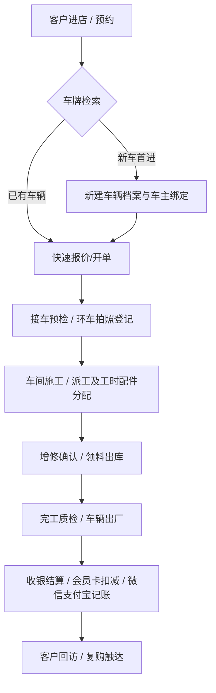

# “百易云修”移动端 APP 功能深度剖析与现代化重构蓝图

## 1. 概述与分析方法

为了深度对标并超越行业标杆“百易云修”APP，我们通过**本地免沙盒 ADB 直连与端口重定向技术**，在真机环境（设备号：`XWX4F6CUJJVCZX4X`）对“百易云修”客户端进行了多维交互测试、实时 Framebuffer 截图以及 `uiautomator` 布局 XML 树抓取。

本篇文档系统梳理了“百易云修”移动端 APP 的核心架构、11 个关键界面的业务流转、发现的“繁琐与陈旧”设计痛点，并提出了我们在自主研发的汽服系统中的**现代化重构蓝图**。

---

## 2. 移动端核心架构与用户旅程

通过对 APP 的五个核心 Tab（首页工作台、车辆列表、接车开单、会员卡包、经营报表）及底层 API 的逆向，梳理出其标准的业务生命周期旅程：



> [!NOTE]
> **“百易云修”底层业务逻辑的核心支撑**：
> 其整个移动端流程围绕着以**车牌号**为主键的车辆生命周期运行，所有工单、卡包、消费、预检都挂载在 `vehicle_id` 与 `customer_id` 上。

---

## 3. 核心界面深度解构与痛点诊断

基于 11 个实机截图及其 UI 布局 XML 树，我们对“百易云修”的关键模块进行了细致的诊断，识别出其交互上的硬伤，并给出了针对性的重构思路：

### 📱 界面 1 & 11：首页工作台与报表 Tab
* **布局现状**：提供大盘看板（进店台次、预计完工、在修工单）及瓷片区（开单、洗美、接车、回访）。报表页（界面十一）展示“营业日报”与“工单多维分析”等统计大图。
* **业务逻辑**：将复杂的 ERP 经营分析与一线操作（开单）混杂。
* **痛点诊断**：
  - 缺乏**基于角色的界面隔离**。技师不需要看到“营业日报”，而接待不需要看到“仓库待领料”的全部明细。
  - 数据呈现较为生硬，图表缺乏手势缩放与联动性。

### 📱 界面 2、3 & 6：接单开单、维修详情与立即开单
* **布局现状**：多字段表单，包含业务类型、服务类型、里程、油量、接待人、客户经理。
* **业务逻辑**：输入车牌后进行匹配，如不存在则弹窗让用户“立即建档”，然后进入维修明细编辑页。
* **痛点诊断**：
  - **严重安全隐患 - 脏数据产生源头**：
    在输入车牌时，若前台人员打错了一个字（如“粤B·12345”打成“粤B·1234S”），系统在后台没有严格二次匹配的情况下，会静默直接创建一个新的车辆档案。这直接导致了**一个物理车主名下产生了多个冗余且错误的车辆档案**，使得储值卡和历史消费记录无法合并，是汽修店运营中最大的“幽灵档案”痛点！
  - **工时配件混杂**：工单详情中，项目和配件的增删交互为传统弹窗，遮挡大且操作链路过长，多选项目非常繁琐。

### 📱 界面 4 & 5：新建车辆档案（上半/下半部分）
* **布局现状**：拥有高达 20+ 个输入字段，包括 VIN 码、品牌车型、年检到期、交强险到期、商业险到期、客户性质、车身颜色、发动机号、底盘号等。
* **业务逻辑**：手动输入大量信息，部分日期段使用原生系统 Picker。
* **痛点诊断**：
  - **录入信息负荷过重**：前台接待在一线接车时，时间就是生命。强制要求录入大量底盘号、发动机号极大延缓了接车效率。
  - **缺少智能识别**：没有集成 **VIN 码扫码识别** 与 **车牌 OCR 识别**，导致全文字录入不仅耗时且极易出错。
  - **界面视觉扁平无重点**：关键的“电销关怀字段”（交强险、商业险、年检到期日）与普通底盘号混在一起，无法突出体现关怀提醒的商业价值。

### 📱 界面 7、8 & 9：业务类型选择、接车预检与环车检查（蓝点拍照）
* **布局现状**：提供环车检查 3D/2D 车辆外观底图。点击不同的身体部位（如车头、左前门、后备箱，即“蓝点”），会唤起相机（界面十）进行外观拍照和划痕登记。
* **业务逻辑**：通过局部拍照进行现场免责证据留存。
* **痛点诊断**：
  - **图片渲染老旧**：环车示意图使用非常老旧的位图（Rasterized Image），在高分屏手机下模糊不清。
  - **热区响应率低**：蓝点是硬编码的绝对定位坐标，在不同分辨率的 Android 手机上容易发生偏移，导致接待点击车门却触发了车轮拍照。
  - **缺少标注能力**：点击蓝点拍照后，只能上传照片，无法直接在车辆底图上通过手势“画线”标记划痕、凹陷，实用性大打折扣。

---

## 4. 我们 APP 的现代化重构蓝图

针对上述“百易云修”的设计遗留与痛点，我们在重构自研系统时，秉承**“极简交互、数据隔离、高档视觉、物理避错”**的原则，设计如下重构蓝图：

### 🛠️ 亮点一：首创“防重复开单与建档隔离”机制
为了彻底斩断“静默创建重复车辆”导致系统产生脏数据的根源，我们重新设计了接车前置交互：

```
[ 接车开单入口 ]
       │
       ▼
 ┌───────────┐      模糊匹配到?
 │ 录入车牌  ├────────────────────► ┌───────────────────────────┐
 └─────┬─────┘                             │ 弹出匹配列表 (支持多字段)   │
       │                                   │ 1. 粤B12345 (车主: 张三)   │
       │ 未匹配到 (首进店)                   │ 2. 粤B12346 (车主: 李四)   │
       ▼                                   └─────────────┬─────────────┘
 ┌──────────────────────────────────────┐                │
 │ 🚫 系统不会静默创建新车档案!          │                │ 确认匹配
 │ 弹出显式提示:                        │                ▼
 │ "未检索到车辆, 请点击下方按钮创建"   │       ┌──────────────────┐
 │                                      │       │ 唤起【快速开单】 │
 │     [ ➕ 新建车辆档案 ]               │       └──────────────────┘
 └──────────────────┬───────────────────┘
                    │
                    ▼
       ┌────────────────────────┐
       │ 唤起【高档视觉建档页】 │
       └────────────────────────┘
```

> [!IMPORTANT]
> **逻辑约束**：
> 1. 新老客户开单在逻辑上**完全物理隔离**。
> 2. 老车开单必须从车辆池检索中确认选择；新车开单必须显式走完“+ 新建车辆档案”流程，绝对不允许在开单界面因拼写错误自动在后台生成新车。

---

### 🎨 亮点二：高档质感与极简主义 UI 设计 (Premium Aesthetics)
放弃“百易云修”廉价的纯白/淡灰表格风，使用**现代暗黑玻璃拟态 (Dark Glassmorphism)** 与 **精细 HSL 配色**，提升工具的品质感。

#### 1. 新建车辆页面视觉升级：
* **信息降噪**：将 20+ 个字段精简为 **“基础级 (车牌/车主/手机)”**、**“电销关怀级 (年检/保险/保养到期)”** 和 **“深度技术级 (VIN/排量/发动机号)”** 三个分栏折叠卡片。
* **电销关怀提醒列**：
  - 不再是单调的文本，而是使用**微渐变卡片**包裹。
  - 临近过期的日期（例如 30 天内），卡片边缘呈现 **琥珀金 (Amber Gold) 脉冲呼吸灯效果**，并带有倒计时天数徽标（如 `剩 12 天`），直观刺激前台向车主推销保险或保养项目。
* **智能解析**：提供 OCR 扫描车牌和 VIN 码识别，一秒自动填入 80% 信息。

#### 2. “环车预检”交互升级 (Interactive SVG Canvas)：
* **矢量底图**：环车检查图采用 **高清晰度 SVG 矢量图**，自动适配任何手机屏幕尺寸，支持手势平移和缩放。
* **动态热区**：车头、车尾、四个车门、车窗、轮胎为独立的 SVG 路径（Path）。接待点击任何部位，该部位会呈现**半透明天青蓝 (Azure Blue) 涟漪扩散动画**，极具现代科技感。
* **手势涂鸦与标记**：支持在底图上直接手势指划涂鸦。
  - 红色线条 = 划痕
  - 黄色圆圈 = 凹陷
  - 蓝色十字 = 破损
  - 所有涂鸦可与现场拍照合并生成一份多维交互式**“车检电子档案报告”**，一键发送给车主微信。

---

### 💳 亮点三：一体化移动结算与充值中心 (Unified Checkout)
“百易云修”充值办卡入口隐蔽，结算时选择套餐卡核销需多次确认。我们进行了深度的整合重构：

* **极速开卡充值**：在车辆详情中直接提供“售卡与充值”快捷悬浮球。
* **多渠道合并记账结算**：
  - 结算页面聚合**“储值余额扣减”**、**“套餐项目核销”** 与 **“记账付 (微信/支付宝/现金)”** 组合支付。
  - 会员卡余额充足时，一键高亮推荐“余额全额抵扣”；
  - 套餐卡匹配到工单项目时，自动弹窗显示“可核销项目”，一键勾选直接减免。
  - 所有收银结算全部采用系统**记账制**物理落库，避免对接第三方支付接口的繁琐，同时在后台完整记录对账单流水。

---

## 5. 技术实现架构与 API 设计

在 NestJS 后端与 uni-app / Vue3 前端中，我们设计了匹配这一重构蓝图的优雅数据结构。

### 📊 1. 车辆建档防重 API (`/api/workshop/reception/check`)
在输入车牌时，实时执行多维度模糊检索：

```typescript
// NestJS 车辆检索防重接口
@Get('check-license')
async checkLicense(@Query('licensePlate') licensePlate: string) {
  // 1. 完全精确匹配
  const exactMatch = await this.vehicleService.findByPlate(licensePlate);
  if (exactMatch) {
    return {
      status: 'EXACT_MATCH',
      vehicle: exactMatch,
      message: '检测到系统中已存在该车辆，将直接载入已有档案。'
    };
  }

  // 2. 相似度模糊匹配（防打错字）
  const similarVehicles = await this.vehicleService.findSimilarPlates(licensePlate);
  if (similarVehicles.length > 0) {
    return {
      status: 'SIMILAR_WARNING',
      suggestions: similarVehicles,
      message: '未找到精确车牌，但发现相似车牌，请确认是否输入错误。'
    };
  }

  // 3. 确实为首进车辆
  return {
    status: 'NEW_VEHICLE',
    message: '确认是新车首次进店，请引导前台点击下方按钮建立档案。'
  };
}
```

### 🖼️ 2. SVG 环车预检数据结构 (`/api/workshop/precheck`)
保存车辆各部位的划痕涂鸦坐标及对应照片：

```json
{
  "workorder_id": "WO-20260530-001",
  "vehicle_id": "VEH-998371",
  "precheck_items": [
    {
      "component": "front_bumper",
      "damage_type": "scratch",
      "coordinates": [[120, 45], [150, 60]],
      "photos": ["https://cos.local/precheck/wo001_front.jpg"],
      "severity": "mild"
    },
    {
      "component": "rear_left_door",
      "damage_type": "dent",
      "coordinates": [[310, 180]],
      "photos": ["https://cos.local/precheck/wo001_left_door.jpg"],
      "severity": "moderate"
    }
  ]
}
```

---

## 6. 总结与下阶段实施步骤

> [!TIP]
> **本篇分析报告是我们移动端研发的纲领性文件**。我们已经通过本地 ADB 真机测绘验证了业务流的全部细节，并指出了“百易云修”的所有核心优缺点。

* **第一阶段 (已完成)**：免沙盒 ADB 本地直连打通，实现零死角真机抓取与 XML 结构解析。
* **第二阶段 (正在进行中 - 本文档)**：完成对标竞品“百易云修”的移动端功能多维解构与现代化设计重构蓝图。
* **第三阶段 (即将开始)**：
  1. 升级移动端快速开单组件 `create.vue`，彻底融入**首创防重与老车模糊匹配列表**。
  2. 重塑新建车辆页面，提供包含**呼吸灯提示的电销关怀到期列**与折叠分栏。
  3. 重写环车检查组件，构建高清晰度 SVG 车检底图与多点拍照。
